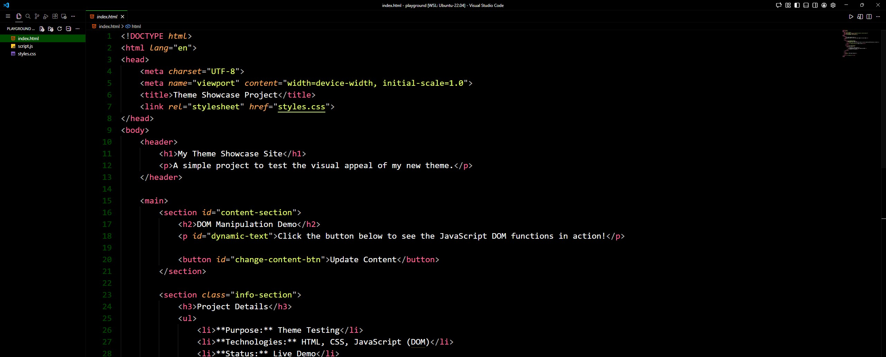
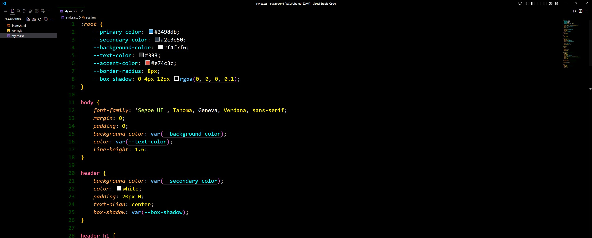
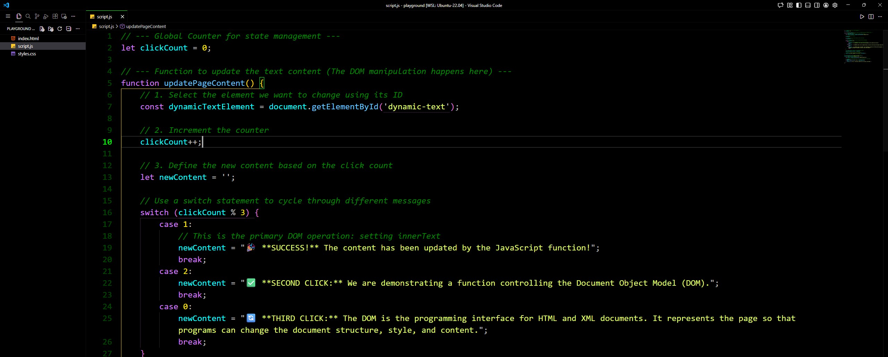

## 🐍 Viper Black VS Code Theme

### A sleek, high-contrast theme for focused coding.

### ✨ Overview

This theme transforms your Visual Studio Code experience with a **pure black background** contrasted by **vibrant, high-visibility colors** for syntax highlighting.

> **Why Viper Black?**
>
> I created this theme because I was tired of the standard, greyish default backgrounds in other themes. Viper Black delivers a straight, uncompromising black canvas, designed to maximize focus and reduce eye strain during long coding sessions.

### 🖼️ Screenshots

This theme features a high-contrast black canvas with vibrant syntax highlighting across popular languages.

#### 🖥️ HTML Code View

#### 🎨 CSS Code View

#### 🚀 JavaScript Code View

### 🚀 How to Use the Theme

Installing Viper Black is simple through the Visual Studio Code Marketplace.

#### **Method 1: VS Code Extensions View**

1.  Open **Visual Studio Code**.
2.  Go to the Extensions view (Ctrl+Shift+X or Cmd+Shift+X).
3.  Search for `Viper Black`.
4.  Click **Install**.
5.  After installation, go to **Code > Preferences > Color Theme** (or Ctrl+K Ctrl+T).
6.  Select **Viper Black** from the list.

#### **Method 2: Marketplace Link**

1.  Click this link: [Install Viper Black Theme](https://marketplace.visualstudio.com/items?itemName=[PLACEHOLDER.YourPublisher].Viper-Black)
2.  Click the **Install** button.

### 🛠️ Challenges Faced (Behind the Code)

As a creator, sharing your challenges adds value and context!

The main challenge I faced when developing this theme was the process of **color specificity** and the limited guidance from the documentation. VS Code offers hundreds of granular settings, and the **VS Code Theme Color Documentation** only describes *what* each setting controls in text, but **lacks visual examples or screenshots**.

This meant that figuring out the exact identifier for every UI element (like the active tab border, the scrollbar thumb, or specific token types in languages like JavaScript and Python) required meticulous, manual testing and iteration. This deep-dive process ultimately resulted in a highly polished and consistently themed final product.